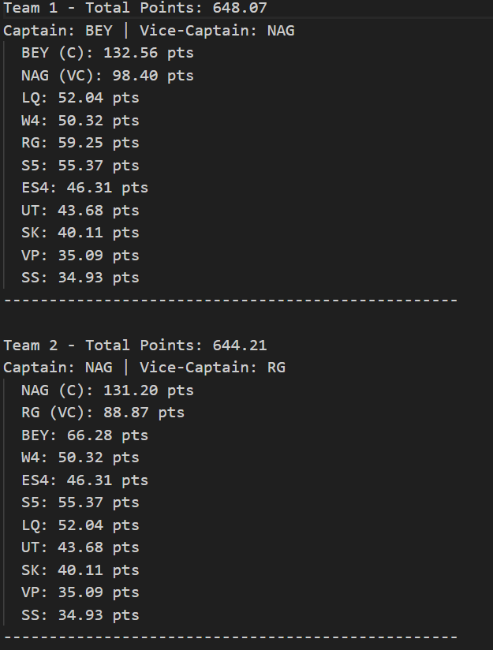
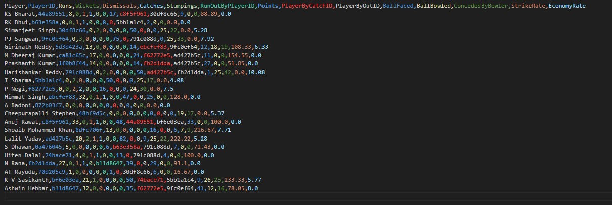

# top-20-fantasy-cricket-teams
AI-based cricket fantasy team generator using player performance prediction.

## 🔧 Features
- AI-based prediction for each player
- Role-balanced teams (Batsman, Bowler, All-Rounder, Wicketkeeper)
- Rotating Captain & Vice-Captain across 20 teams
- Uses XGBoost, pandas, NumPy, 

## 🧠 ML Model
- Input: Player stats CSVs (e.g., runs, wickets, economy, dismissal, catches, stumping, points, etc)
- Output: Predicted score per player
- Algorithm: XGBoost Regression

## 🎯 Team Rules
- 11 players per team
- 1-5 players per role (Batsman, Bowler, etc.)
- Each player used at least once as C or VC
- Teams sorted by predicted points

## 📸 Example Output

## 📌 Next Steps
- Add UI for inputting match squads
- Train with live match data
- Export to Crickedge live cricket score app

## app interface

